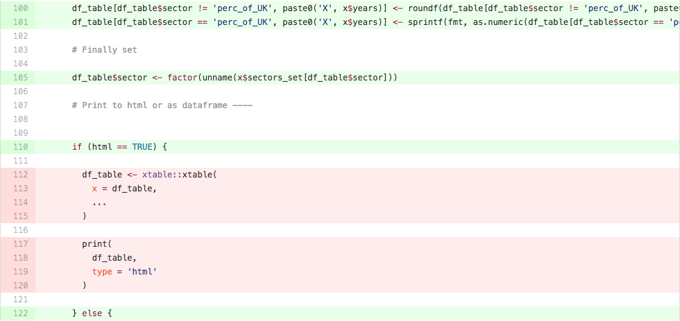

# Code Coverage

Writing tests for our code we can ensure that it works as expected and check when changes to that code break pre-existing functionality. But how do we know whether we have tested each possible scenario for our functions? How do we know which lines of code are ran during our tests? This is where code coverage comes in. Code coverage is a measure of the amount of code being exercised by a set of tests. It is an indirect measure of test quality and completeness. 

For example, in the code below, we can see that lines 112-115 and 117-120 are not explicitly tested. In this case, we probably don’t need to worry very much, but on other occasions this might prompt us to write more tests.

```{r codecov, echo = FALSE, fig.cap = "Code Coverage"}

```

> Measuring code coverage allows developers to asses their progress in quality checking their own (or their collaborators) code. Measuring code coverage allows code consumers to have confidence in the measures taken by the package authors to verify high code quality. -- [Jim Hester](https://cran.r-project.org/web/packages/covr/vignettes/how_it_works.html#introduction)

## Coverage Services {#codecov}

* [Codecov](http://codecov.io)
* [Coveralls](http://coveralls.io)

## R

[`covr`](https://github.com/jimhester/covr) allows the user to track and report code coverage for your package and (optionally) upload the results to a [coverage service](#codecov) like Codecov or Coveralls. `covr` works with both `RUnit` and `testthat`, though we are [using `testthat` for our tests](#tests). `covr` provides three functions to calculate test coverage:

- `package_coverage()` performs coverage calculation on an R package (unit tests must be contained in the "tests" directory) 
- `file_coverage()` performs coverage calculation on one or more R scripts by executing one or more R scripts.
- `function_coverage()` performs coverage calculation on a single named function, using an expression provided

Please read the [documentation](https://cran.r-project.org/web/packages/covr/vignettes/how_it_works.html) for more information on how `covr` works.
